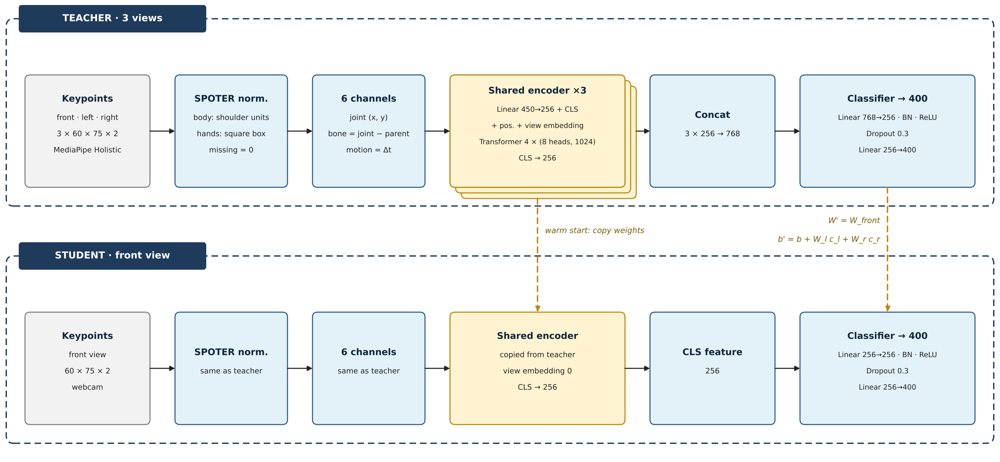

# VSL400 · SPOTER

Nhận dạng 400 ký hiệu từ đơn của ngôn ngữ ký hiệu Việt Nam từ keypoint MediaPipe, dùng một
camera. Mô hình thầy học từ ba góc nhìn; mô hình trò được khởi tạo từ thầy và chỉ dùng góc
chính diện.



- **Chuẩn hoá SPOTER**: thân theo khoảng cách hai vai, mỗi bàn tay một hộp vuông riêng.
- **6 kênh đầu vào**: toạ độ khớp, xương, chuyển động.
- **Bộ mã hoá dùng chung**: Transformer 4 lớp, d = 256, token CLS, view embedding.
- **Khởi động ấm**: trò chép bộ mã hoá của thầy; đóng góp của hai góc bị tắt được gộp vào bias.

## Kết quả

| Mô hình | Top-1 | Top-5 | Macro-F1 | Tham số |
|---|---|---|---|---|
| Trò · 1 góc | 89,51 % | 97,81 % | 0,899 | 3,48 M |

Tập test gồm 9.751 video của 10 người ký không xuất hiện khi huấn luyện.

## Dữ liệu

Repo không chứa dữ liệu hay trọng số mô hình. Bộ dữ liệu VSL400 được cấp quyền truy cập có
kiểm soát tại [Zenodo](https://zenodo.org/records/17943574); người dùng cần tự gửi yêu cầu và
đồng ý *Data Usage Agreement*.

Định dạng đầu vào: Bao gồm `pose` (T, 33),
`left_hand` (T, 21), `right_hand` (T, 21) với T là số khung; `index.csv` với các cột
`part, video_id, signer_id, gloss, label`; `labels.json` gồm 400 nhãn. Keypoint có thể trích từ
video bằng `tools/extract_keypoints.py`.

## Cài đặt

```bash
pip install -r requirements.txt
pip install -e .
```

## Huấn luyện

Khai báo `paths` trong một file cấu hình, ví dụ `configs/local.yaml`:

```yaml
paths:
  keypoint_root: /path/to/keypoints
  index_csv: /path/to/index.csv
  labels_json: /path/to/labels.json
```

```bash
python scripts/prepare_data.py  --config configs/local.yaml
python scripts/train_teacher.py --config configs/local.yaml
python scripts/train_student.py --config configs/local.yaml
python scripts/evaluate.py      --config configs/local.yaml
python scripts/export_onnx.py   --config configs/local.yaml
```

## Cấu trúc

```
configs/default.yaml   siêu tham số
src/vsl400/
  data/                chia theo người ký, chuẩn hoá, tăng cường, dataset
  models/              kiến trúc thầy / trò, khởi động ấm
  training/            vòng huấn luyện, EMA, mixup
  evaluation.py        dự đoán và chỉ số
  export.py            xuất ONNX có sẵn bước chuẩn hoá
scripts/               chuẩn bị dữ liệu, huấn luyện, đánh giá, xuất mô hình
tools/                 trích keypoint từ video
```

## Trích dẫn

Vui lòng trích dẫn bộ dữ liệu VSL400 theo mẫu trên trang Zenodo, và SPOTER:

```bibtex
@inproceedings{bohacek2022spoter,
  title     = {Sign Pose-based Transformer for Word-level Sign Language Recognition},
  author    = {Boh{\'a}{\v{c}}ek, Maty{\'a}{\v{s}} and Hr{\'u}z, Marek},
  booktitle = {IEEE/CVF Winter Conference on Applications of Computer Vision Workshops},
  year      = {2022},
  doi       = {10.1109/WACVW54805.2022.00024}
}
```

## Giấy phép

Mã nguồn: [MIT](LICENSE). Bộ dữ liệu VSL400 tuân theo điều khoản riêng của chủ sở hữu.
